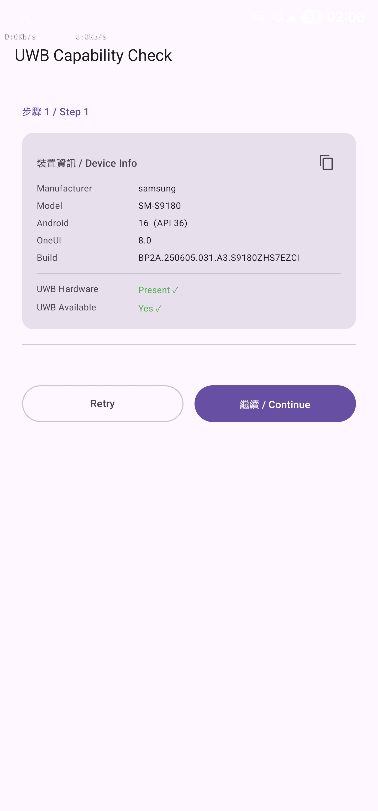
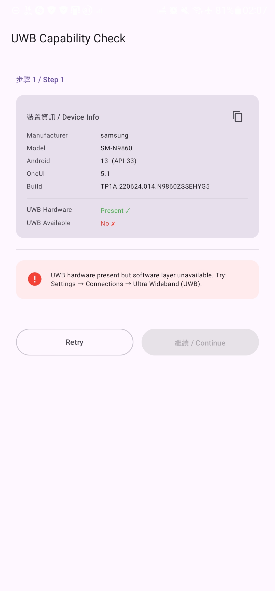
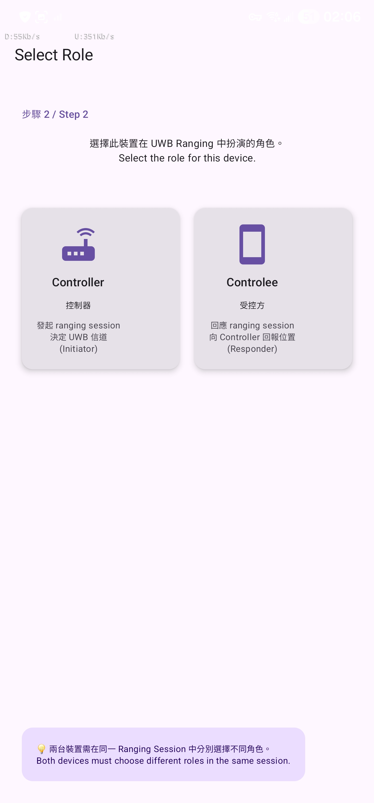
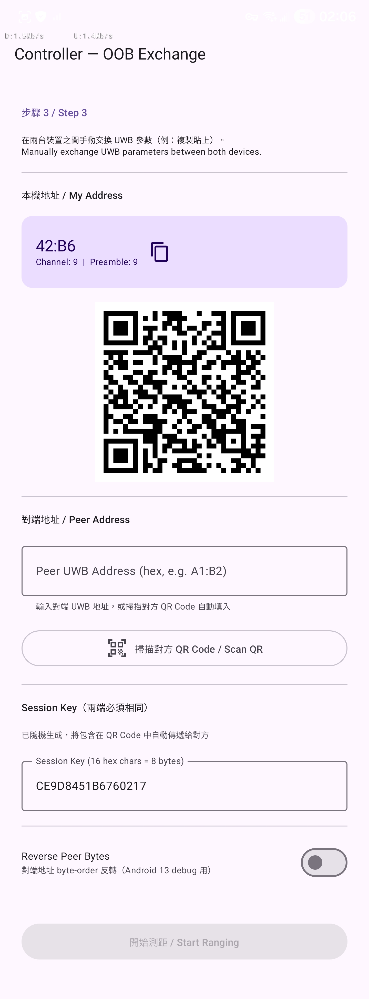
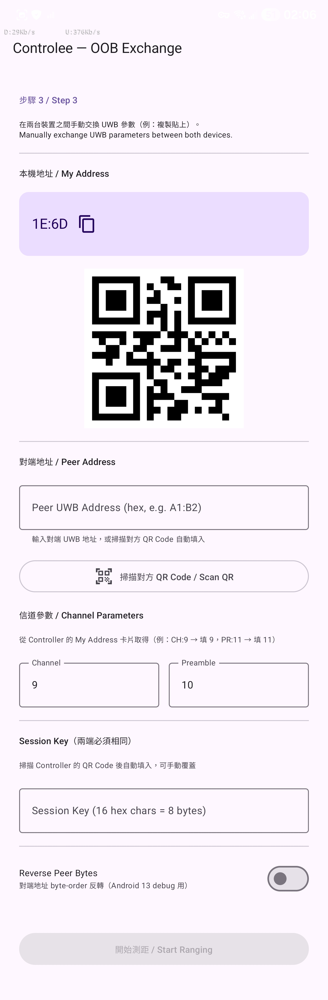

<p align="center">
  
</p>

# UWB Tester

[](https://developer.android.com)
[](https://kotlinlang.org)
[](https://developer.android.com/jetpack/compose)
[](https://developer.android.com/jetpack/androidx/releases/core-uwb)
[](LICENSE)

> 以 `androidx.core.uwb:uwb:1.0.0`（2026-05-06 首個穩定版）實作的 Android UWB 學習示範專案。  
> A hands-on Android sample demonstrating UWB ranging with the first stable release of `androidx.core.uwb:1.0.0`.

---

## 目錄 / Table of Contents

- [專案背景](#專案背景--background)
- [專案概述](#專案概述--overview)
- [操作說明](#操作說明--how-to-use)
- [裝置需求](#裝置需求--device-requirements)
- [技術棧](#技術棧--tech-stack)
- [架構說明](#架構說明--architecture)
- [快速開始](#快速開始--quick-start)
- [應用程式流程](#應用程式流程--app-flow)
- [OOB 參數交換操作步驟](#oob-參數交換操作步驟--oob-exchange-walkthrough)
- [裝置相容性說明](#裝置相容性說明--device-compatibility-notes)
- [UWB 核心概念](#uwb-核心概念--uwb-core-concepts)
- [單元測試](#單元測試--unit-testing)
- [Release](#release)
- [已知限制](#已知限制--known-limitations)
- [專案結構](#專案結構--project-structure)
- [授權](#授權--license)

---

## 專案背景 / Background

過去曾接觸 MIT App Inventor，也 clone 過別人的 Android 專案，但面對陌生的專案架構加上手頭有其他事，就這樣擱置了——拖延這個老毛病一拖就是好幾年。

近期想做一個 UWB 相關的 IoT 側項目（之後再說），正好 `androidx.core.uwb` 前陣子終於從 alpha 走到 GA（1.0.0 於 2026-05-06 發布），時機對上了，就趁這個機會認真研究一次 Android 開發。

這次不只是把功能跑起來而已——把兩年工程師生涯學到的那些東西：Git Flow、CI/CD、單元測試、Clean Architecture、MVVM，還有 AI 輔助開發流程，全部一起整進來。當作一次完整的學習。

This project started as a way to explore UWB technology for an upcoming IoT side project. Rather than just getting the feature working, it became a platform to apply modern Android engineering practices — clean architecture, unit testing, CI/CD, and Git Flow — from scratch.

---

## 專案概述 / Overview

本專案為 UWB（超寬帶，Ultra Wideband）技術的入門學習範例，涵蓋：

- ✅ UWB 硬體與軟體能力的執行期檢查
- ✅ Controller / Controlee 雙角色支援
- ✅ 手動 OOB（Out-of-Band）參數交換流程
- ✅ QR Code 輔助 OOB 參數交換
- ✅ 即時距離（公尺）、方位角（Azimuth）、仰角（Elevation）顯示
- ✅ Android 13 byte-order debug 工具

This project is a learning-focused Android UWB sample covering:
capability checks, dual-role ranging (Controller/Controlee), manual and QR Code OOB exchange,
and real-time distance/AoA display. Includes a byte-reversal debug toggle for Android 13 address byte-order issues.

> ⚠️ **雙機驗證狀態**：目前開發者僅有一台可用 UWB 的裝置（SM-S9180），**尚未完成雙機實際測距驗證**。App 已可正常開啟至 OOB Exchange 頁面，但 ranging 端對端流程尚待雙機環境確認。
>
> **Dual-device status**: Only one UWB-capable device (SM-S9180) is available for development. The app runs to the OOB Exchange screen, but end-to-end ranging has not yet been verified with two devices.

---

## 操作說明 / How to Use

> ⚠️ 完整的測距功能需要**兩台**支援 UWB 的裝置，各自安裝此 App。

### Step 1 — Capability Check（能力確認）

兩台裝置分別開啟 App，第一個畫面會顯示裝置資訊與 UWB 可用性：

- **UWB Hardware: ✓ / API Available: ✓** → 可繼續
- **UWB Hardware: ✓ / API Available: ✗** → 硬體存在但系統層停用（見[裝置相容性說明](#裝置相容性說明--device-compatibility-notes)）
- **UWB Hardware: ✗** → 此裝置無 UWB 硬體

點擊「繼續」進入下一步。

| S23 Ultra（UWB 可用）| Note20 Ultra（UWB 不可用）|
|:---:|:---:|
|  |  |

---

### Step 2 — Role Select（角色選擇）

一台選 **Controller**（發起方，決定 UWB 信道），另一台選 **Controlee**（回應方）。

<p align="center">
  
</p>

---

### Step 3 — OOB Exchange（參數交換）

UWB 本身不處理裝置探索，需透過其他管道（本 App 支援手動複製貼上或 QR Code）交換連線參數。

| Controller | Controlee |
|:---:|:---:|
|  |  |

**交換步驟：**

| 步驟 | Controller 端 | Controlee 端 |
|---|---|---|
| 1 | 畫面顯示 My Address + Channel + Preamble | 畫面顯示 My Address |
| 2 | 複製「A1:B2  CH:9  PR:10」格式字串 | 複製「C3:D4」格式地址 |
| 3 | 在「Peer Address」輸入 Controlee 的地址 | 在「Peer Address」輸入 Controller 的地址 |
| 4 | Channel / Preamble 已自動填入 | 手動輸入 Channel=9、Preamble=10 |
| 5 | 確認 Session Key 一致（預設 `0102030405060708`）| 確認 Session Key 一致 |
| 6 | 點擊「開始測距」| 點擊「開始測距」|

> 💡 **QR Code 快捷**：Controller 端可點擊 QR Code 圖示產生參數 QR Code，Controlee 端掃描後自動填入，省去手動輸入。

---

### Step 4 — Ranging（測距）

雙機同時開始後，畫面顯示即時距離（公尺）、Azimuth 方位角、Elevation 仰角。

> 📝 此步驟尚待雙機環境驗證。

---

## 裝置需求 / Device Requirements

**最低需求 / Minimum Requirements**
- `minSdk = 31`（Android 12）— `UWB_RANGING` 執行期權限的最低版本
- UWB 硬體（`PackageManager.FEATURE_UWB`）
- 前景模式使用（Android 13 及以下不支援背景測距）
- 兩支支援 UWB 的裝置，分別擔任 Controller 與 Controlee 角色

> **Android 12+ badge 的意思是**：App 最低可安裝於 Android 12。但 UWB 能否使用還需另外三層條件：硬體存在、系統 API 可用（`UwbManager.isAvailable()`）、執行期權限授予。Android 版本本身不保證 UWB 可用。

**已知支援 UWB 的 Samsung 機型（非完整清單）**

| 系列 | 支援型號 |
|---|---|
| Galaxy S21 | S21+, S21 Ultra |
| Galaxy S22 | S22+, S22 Ultra |
| Galaxy S23 | S23+, S23 Ultra |
| Galaxy S24 | S24+, S24 Ultra |
| Galaxy S25 | S25+, S25 Ultra |
| Galaxy Z Fold | Z Fold 3 以後部分型號 |
| Galaxy Note | Note 20 Ultra（視韌體版本，見下方說明）|

> 💡 **測試環境**：本專案開發與測試均在以下裝置上進行，供參考：
> - **Samsung SM-S9180**（Galaxy S23 Ultra）— BRI 台灣版，OneUI 8.0，Android 16（API 36）✅ UWB 可用
> - **Samsung SM-N9860**（Galaxy Note20 Ultra）— OneUI 5.1，Android 13（API 33）❌ UWB Available = No（UWB 硬體存在，但系統層停用）
>
> 其他支援 UWB 的裝置應同樣可用，但未經測試。

---

## 技術棧 / Tech Stack

| 類別 | 套件 | 版本 |
|---|---|---|
| 語言 | Kotlin | 2.2.10 |
| UI | Jetpack Compose BOM | 2026.04.01 |
| 導航 | Navigation Compose | 2.8.9 |
| DI | Hilt | 2.56.2 |
| 非同步 | Kotlin Coroutines + StateFlow | 1.9.0 |
| **UWB** | **androidx.core.uwb** | **1.0.0** |
| QR Code | zxing-android-embedded | 4.3.0 |
| Build | Android Gradle Plugin | 9.2.1 |
| Code gen | KSP | 2.3.2 |

**SDK 版本 / SDK Versions**

| 項目 | 版本 |
|---|---|
| `compileSdk` | 36（Android 16）|
| `targetSdk` | 35（Android 15）|
| `minSdk` | 31（Android 12）|

---

## 架構說明 / Architecture

本專案採用 **MVVM + Clean Architecture** 三層分離設計。

### 分層圖 / Layer Diagram

```
┌─────────────────────────────────────────────────────────┐
│  presentation/                                          │
│  ┌─────────────────────────────────────────────────┐   │
│  │  Screen (Compose)  ←→  ViewModel                │   │
│  │  只知道 domain model，不知道 data 層的存在        │   │
│  └─────────────────────────────────────────────────┘   │
├─────────────────────────────────────────────────────────┤
│  domain/（純 Kotlin，零 Android import）                 │
│  ┌──────────────┐  ┌─────────────┐  ┌───────────────┐  │
│  │    model/    │  │ repository/ │  │   usecase/    │  │
│  │  (data class)│  │ (interface) │  │（業務邏輯封裝）│  │
│  └──────────────┘  └─────────────┘  └───────────────┘  │
├─────────────────────────────────────────────────────────┤
│  data/（實作 domain 介面）                               │
│  ┌────────────────────┐  ┌──────────────────────────┐  │
│  │  uwb/              │  │  repository/             │  │
│  │  UwbManagerWrapper │  │  UwbRepositoryImpl       │  │
│  │  RangingResultMapper│  │  （快取 UwbScope）       │  │
│  │  ← 唯一接觸 UWB API│  │                          │  │
│  └────────────────────┘  └──────────────────────────┘  │
├─────────────────────────────────────────────────────────┤
│  di/  UwbModule（Hilt 黏合上下層）                      │
└─────────────────────────────────────────────────────────┘
```

### 為什麼這樣分層？

| 層 | 職責 | 可測試性 |
|---|---|---|
| domain | 業務規則（狀態機轉換、資料模型）| 純 JUnit，不需 Android 環境 |
| data | UWB API 呼叫、錯誤轉換、scope 管理 | Mockito mock UwbManagerWrapper |
| presentation | UI 狀態渲染、使用者互動 | ComposeTest / 快照測試 |

---

## 快速開始 / Quick Start

### 前置需求 / Prerequisites

1. Android Studio Panda 2025.3.x 或更新版本
2. Gradle 8.13（`gradle-wrapper.properties` 已設定，會自動下載）
3. 兩台 UWB 支援的 Android 裝置（見 [裝置需求](#裝置需求--device-requirements)）

### 建置步驟 / Build Steps

```bash
# Clone 專案
git clone https://github.com/timliucode/uwb-tester.git
cd uwb-tester

# 在 Android Studio 開啟，等待 Gradle sync 完成
# 或透過命令列建置（需要 ANDROID_HOME 環境變數）
./gradlew assembleDebug
```

### 安裝到裝置

```bash
# 安裝到 S23 Ultra（Controller）
adb -s <S23_SERIAL> install app/build/outputs/apk/debug/app-debug.apk

# 安裝到另一台裝置（Controlee）
adb -s <DEVICE_SERIAL> install app/build/outputs/apk/debug/app-debug.apk
```

---

## 應用程式流程 / App Flow

```
[兩台裝置] → CapabilityCheck → RoleSelect → OobExchange → Ranging
                                                ↑
                              手動複製貼上 或 QR Code 交換地址 + 信道參數
```

1. **Capability Check**：兩台裝置分別確認 UWB 可用（顯示裝置資訊供複製）
2. **Role Select**：一台選 Controller（發起方），另一台選 Controlee（回應方）
3. **OOB Exchange**：互相交換地址，填入 Channel、Session Key
4. **Ranging**：查看即時距離與 AoA 數據

---

## OOB 參數交換操作步驟 / OOB Exchange Walkthrough

OOB（Out-of-Band）表示 UWB 本身不處理裝置探索，需要透過其他管道交換連線參數。本 App 支援手動複製貼上與 QR Code 兩種方式。

### 操作流程（兩台裝置需同步操作）

| 步驟 | Controller 端 | Controlee 端 |
|---|---|---|
| 1 | 進入 OOB 畫面，看到 My Address + Channel + Preamble | 進入 OOB 畫面，看到 My Address |
| 2 | 點擊複製圖示，複製「A1:B2  CH:9  PR:10」格式的字串 | 點擊複製圖示，複製「C3:D4」格式的地址 |
| 3 | 在「Peer Address」輸入 C3:D4（從 Controlee 複製而來） | 在「Peer Address」輸入 A1:B2（從 Controller 複製而來） |
| 4 | Channel/Preamble 已自動填入 | 手動輸入 Channel=9、Preamble=10（從 Controller 得知） |
| 5 | 確認 Session Key 一致（預設 `0102030405060708`） | 確認 Session Key 一致 |
| 6 | 點擊「開始測距」| 點擊「開始測距」|

> 💡 **實際 App 中**，OOB 交換通常透過 BLE（藍牙低功耗）自動完成。本 App 以手動方式呈現以便學習理解。

---

## 裝置相容性說明 / Device Compatibility Notes

### UWB 可用性確認

在 CapabilityCheckScreen（步驟 1）中：
- **Hardware Present = ✓ / API Available = ✓**：完全支援，可繼續
- **Hardware Present = ✗**：此裝置無 UWB 硬體
- **Hardware Present = ✓ / API Available = ✗**：硬體存在但系統層停用

硬體存在但 API 不可用的可能原因：
- 韌體 CSC 版本的地區政策限制（Samsung 部分地區版本會停用 UWB）
- OneUI 版本與 `androidx.core.uwb` API 的相容性問題

畫面同時顯示裝置型號、Android 版本、Build ID，可一鍵複製供回報或除錯使用。

### Android 13 已知問題

Android 13（API 33）存在 UWB 地址 byte-order 問題：
- 症狀：CapabilityCheck 通過，但 ranging 永遠停在 Initializing
- 解決：在 OOB Exchange 畫面開啟「Reverse Bytes」開關後重試
- 此問題與裝置型號、品牌、韌體地區版本無關，是 AOSP OS 層問題

### Samsung 韌體地區版本說明

Samsung 裝置的 CSC（Customer Software Customization）代碼決定韌體地區設定，部分地區版本可能影響 UWB 可用性。Step 1 的裝置資訊卡會顯示 Build ID，可由此判斷韌體版本。台灣（BRI）、香港（TGY）等版本通常完整支援 UWB。

---

## UWB 核心概念 / UWB Core Concepts

### 什麼是 UWB？

Ultra Wideband（超寬帶）是一種短距離無線通訊技術，透過極短的脈衝訊號實現**精確的空間感知**：

- 測距精度：± 10 cm 級別（相較於 Wi-Fi/BLE 的 ±1-3 m）
- 測距距離：約 10-30 m（室內環境）
- 角度測量：Azimuth（水平方位角）+ Elevation（垂直仰角）
- 標準：IEEE 802.15.4z / FiRa Consortium

### Controller vs Controlee

| 角色 | 職責 | API |
|---|---|---|
| Controller | 發起 session，決定 UWB 信道 | `UwbManager.controllerSessionScope()` |
| Controlee | 回應 session，向 Controller 回報位置 | `UwbManager.controleeSessionScope()` |

### Ranging Session 生命週期

```
1. 申請 UWB_RANGING 執行期權限
   ↓
2. 建立 UwbScope（Controller 或 Controlee）
   → 取得 localAddress（+ channel/preamble for Controller）
   ↓
3. OOB 參數交換（本 App 使用手動複製或 QR Code）
   ↓
4. 建立 RangingParameters
   - uwbConfigType = CONFIG_UNICAST_DS_TWR
   - sessionKeyInfo（8 bytes，兩端一致）
   - complexChannel（來自 Controller scope）
   - peerDevices（對端地址）
   ↓
5. scope.prepareSession(params).execute() → Flow<RangingResult>
   ↓
6. 收集 Flow：
   RangingResultInitialized     → 握手成功
   RangingResultPosition        → 距離 + AoA 資料
   RangingResultPeerDisconnected → 對端離開
   RangingResultFailure          → 錯誤（含 reason code）
   ↓
7. 取消 Flow 收集 → 停止 ranging
```

### ⚠️ Scope 快取的重要性

每次呼叫 `controllerSessionScope()` 都會**產生新的地址**。
如果取地址和開始 ranging 用了不同的 scope，session 永遠無法建立。

本 App 在 `UwbRepositoryImpl` 中快取 scope，確保 OOB 顯示的地址和 ranging 使用的地址來自同一個 scope。

---

## 單元測試 / Unit Testing

測試套件位於 [`feature/unit-tests`](https://github.com/timliucode/uwb-tester/tree/feature/unit-tests) 分支，共 **100 個 JVM 測試**全數通過。

### 測試框架

| 套件 | 版本 | 用途 |
|---|---|---|
| JUnit4 | 4.13.2 | 基礎測試框架 |
| Mockito-Kotlin | 5.4.0 | Mock 依賴 |
| Turbine | 1.2.0 | Flow 測試 |
| Truth | 1.4.4 | 斷言 |
| Coroutines Test | 1.9.0 | 協程測試 |
| Arch Core Testing | 2.2.0 | LiveData/ViewModel |
| Robolectric | 4.14.1 | Build.* 靜態欄位初始化 |

### 測試涵蓋範圍

- **Domain model**：UwbDeviceInfo, RangingState, UwbCapability, OobParams
- **Domain usecase**：CheckUwbCapability, GetLocalAddress, StartRanging
- **Data**：RangingResultMapper
- **Presentation ViewModel**：CapabilityCheck, OobExchange, Ranging

### 執行測試

```bash
./gradlew test
```

---

## Release

| 版本 | 日期 | 主要變更 |
|---|---|---|
| [v0.2.1](https://github.com/timliucode/uwb-tester/releases/tag/v0.2.1) | 2026-05-19 | 補齊 QR Code 與 Session Key 測試覆蓋 |
| [v0.2.0](https://github.com/timliucode/uwb-tester/releases/tag/v0.2.0) | 2026-05-19 | QR Code OOB 交換 + UI 改進 |
| [v0.1.0](https://github.com/timliucode/uwb-tester/releases/tag/v0.1.0) | 2026-05-19 | 初始版本 |

---

## 已知限制 / Known Limitations

| 項目 | 說明 |
|---|---|
| 雙機驗證 | 目前僅有一台可用 UWB 裝置，端對端 ranging 流程尚未雙機驗證 |
| 背景測距 | Android 13（Note20 Ultra）不支援背景 UWB ranging |
| Static STS | Session Key 為靜態，僅適合學習用途；生產環境應使用 Dynamic STS（需 FiRa 認證）|
| OOB 機制 | 本 App 使用手動複製貼上與 QR Code；真實 App 應透過 BLE 自動交換 |
| 多裝置 ranging | 目前僅支援兩裝置一對一 ranging |
| iOS 不支援 | `androidx.core.uwb` 為 Android 專屬；iOS 需使用 Apple NearbyInteraction（不同 API）|

---

## 專案結構 / Project Structure

```
app/src/main/java/com/example/uwbtest/
│
├── UwbApp.kt                     @HiltAndroidApp 入口
│
├── di/
│   └── UwbModule.kt              Hilt 依賴注入模組
│
├── domain/                       ← 純 Kotlin，零 Android import
│   ├── model/
│   │   ├── UwbCapability.kt      裝置 UWB 能力描述
│   │   ├── RangingState.kt       Ranging 狀態機（sealed interface）
│   │   ├── UwbDeviceInfo.kt      本機地址 + 角色資訊
│   │   └── OobParams.kt          OOB 交換的參數集合
│   ├── repository/
│   │   └── UwbRepository.kt      抽象介面
│   └── usecase/
│       ├── CheckUwbCapabilityUseCase.kt
│       ├── GetLocalAddressUseCase.kt
│       └── StartRangingUseCase.kt
│
├── data/                         ← 唯一接觸 androidx.core.uwb.* 的層
│   ├── uwb/
│   │   ├── UwbManagerWrapper.kt  封裝 UwbManager
│   │   └── RangingResultMapper.kt RangingResult → RangingState
│   └── repository/
│       └── UwbRepositoryImpl.kt  UwbRepository 實作（含 Scope 快取）
│
└── presentation/
    ├── MainActivity.kt
    ├── theme/Theme.kt
    ├── navigation/
    │   ├── Screen.kt             路由定義
    │   └── AppNavGraph.kt        NavHost 組合
    ├── screen/
    │   ├── capability/           Screen 1：UWB 能力檢查
    │   ├── roleselect/           Screen 2：角色選擇
    │   ├── oob/                  Screen 3：OOB 參數交換
    │   └── ranging/              Screen 4：測距結果
    └── component/
        ├── PermissionHandler.kt  可重用的權限申請元件
        └── UwbStatusBadge.kt     顏色狀態徽章
```

---

## 授權 / License

本專案採用 [MIT License](LICENSE)。

---

*本專案為學習用途。UWB 相關硬體存取需在支援裝置上測試。*  
*This project is for educational purposes. UWB hardware access must be tested on supported devices.*
